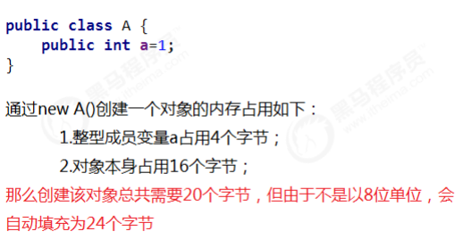
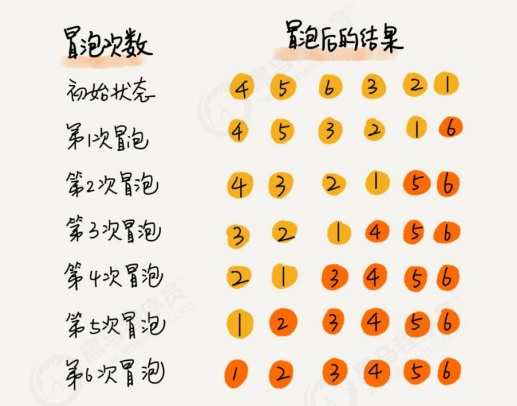
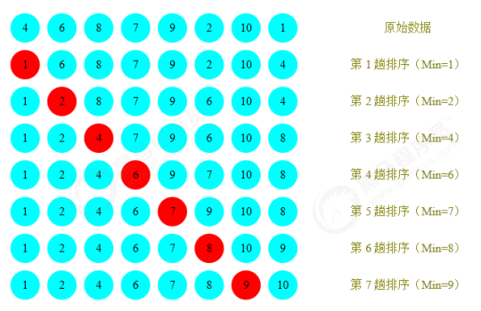
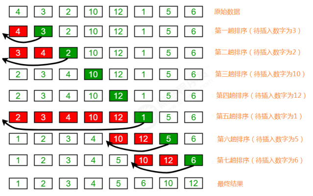
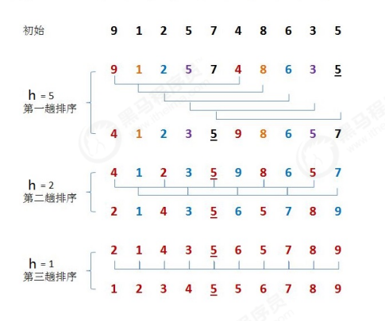
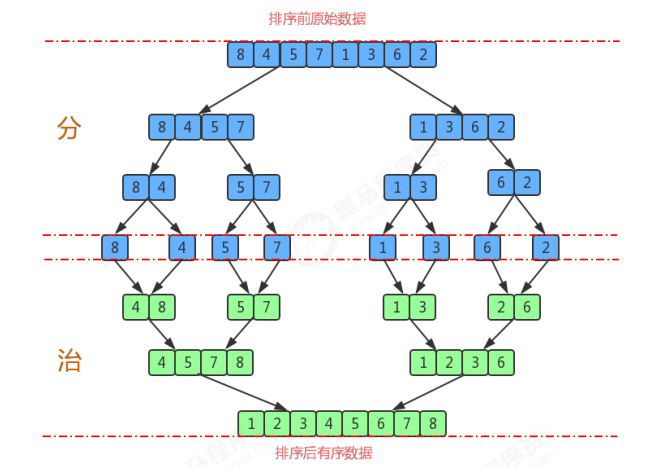
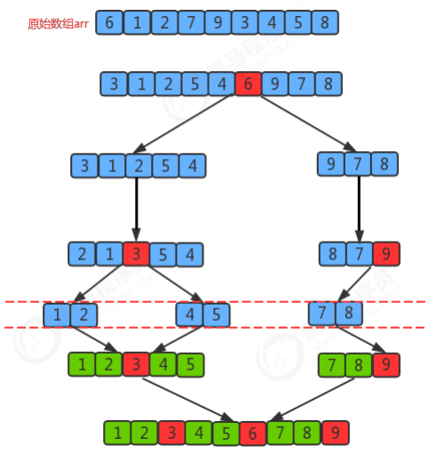

# 数据结构与算法

## 一.算法分析

### 1.算法的时间复杂度分析

+ ***事后分析估算方法：*** 比较容易想到的方法就是我们把算法执行若干次，然后拿个计时器在旁边计时。**但是这种方法有很大的缺陷：必须依据算法实现编制好的测试程序，通常要花费大量时间和精力，测试完 了如果发现测试的是非常糟糕的算法，那么之前所做的事情就全部白费了，并且不同的测试环境(硬件环境)的差别 导致测试的结果差异也很大。**
+ ***事前分析估算方法：*** 在计算机程序编写前，依据统计方法对算法进行估算，经过总结，我们发现一个高级语言编写的程序程序在计算机 上运行所消耗的时间取决于下列因素：
  1. **算法采用的策略和方案；**
  2.  **编译产生的代码质量；** 
  3. **问题的输入规模(所谓的问题输入规模就是输入量的多少)；** 
  4. **机器执行指令的速度；**

+ ***==主要分把核心操作的次数和输入规模关联有以下规则：==***
  1. **算法函数中的常数可以忽略；**
  2. **算法函数中最高次幂的常数因子可以忽略；**
  3. **算法函数中最高次幂越小，算法效率越高**

+ ***大O计法：***
  1. **用常数1取代运行时间中的所有加法常数**
  2.  **在修改后的运行次数中，只保留高阶项**
  3. **如果最高阶项存在，且常数因子不为1，则去除与这个项相乘的常数**

### **2.算法的空间复杂度分析**

***java中常见内存占用*** 

1. 基本数据类型内存占用情况：

| 数据类型 | 内存占用字节数 |
| :------: | :------------: |
|   byte   |       1        |
|  short   |       2        |
|   int    |       4        |
|   long   |       8        |
|  float   |       4        |
|  double  |       8        |
| boolean  |       1        |
|   char   |       2        |

2. 计算机访问内存的方式都是一次一个字节

   

3. 一个引用（机器地址）需要8个字节表示： 例如： Date date = new Date(),则date这个变量需要占用8个字节来表示

4. 创建一个对象，比如new Date()，除了Date对象内部存储的数据(例如年月日等信息)占用的内存，该对象本身也 有内存开销，每个对象的自身开销是16个字节，用来保存对象的头信息

5. 一般内存的使用，如果不够8个字节，都会被自动填充为8字节：

   

6. java中数组被被限定为对象，他们一般都会因为记录长度而需要额外的内存，一个原始数据类型的数组一般需要 24字节的头信息(==16个自己的对象开销，4字节用于保存长度以及4个填充字节==)再加上保存值所需的内存。

---

## 二.排序

### 简单排序

#### 冒泡排序

***排序原理：***

1. 比较相邻的元素。如果前一个元素比后一个元素大，就交换这两个元素的位置。 
2. 对每一对相邻元素做同样的工作，从开始第一对元素到结尾的最后一对元素。最终最后位置的元素就是最大 值。



***时间复杂度：*O(N²)**

#### 选择排序

***排序原理：*** 

1. 每一次遍历的过程中，都假定第一个索引处的元素是最小值，和其他索引处的值依次进行比较，如果当前索引处 的值大于其他某个索引处的值，则假定其他某个索引出的值为最小值，最后可以找到最小值所在的索引 
2. 交换第一个索引处和最小值所在的索引处的值



***时间复杂度：*O(N²)**

#### 插入排序

***排序原理：*** 

1. 把所有的元素分为两组，已经排序的和未排序的； 
2. 找到未排序的组中的第一个元素，向已经排序的组中进行插入； 
3. 倒叙遍历已经排序的元素，依次和待插入的元素进行比较，直到找到一个元素小于等于待插入元素，那么就把待 插入元素放到这个位置，其他的元素向后移动一位；



***时间复杂度：*O(N²)**

### 高级排序

#### 希尔排序

***排序原理：*** 

1. 选定一个增长量h，按照增长量h作为数据分组的依据，对数据进行分组； 

2. 对分好组的每一组数据完成插入排序； 

3. 减小增长量，最小减为1，重复第二步操作。

4. 增长量h的确定：增长量h的值没有固定的规则，我们这里采用以下规则：

   ```java
   //初始化希尔排序的分组值
   int h = 1;
   while (h < length/2){
       h = 2*h+1;
   }
   ```



***时间复杂度分析：*** 在希尔排序中，增长量h并没有固定的规则，有很多论文研究了各种不同的递增序列，但都无法证明某个序列是最 好的，对于希尔排序的时间复杂度分析，已经超出了我们课程设计的范畴，所以在这里就不做分析了。 我们可以使用事后分析法对希尔排序和插入排序做性能比较。

#### 归并排序

***排序原理（利用递归思想）：***

1. 尽可能的一组数据拆分成两个元素相等的子组，并对每一个子组继续拆分，直到拆分后的每个子组的元素个数是 1为止。
2.  将相邻的两个子组进行合并成一个有序的大组； 
3. 不断的重复步骤2，直到最终只有一个组为止。



***时间复杂度：*** **O(nlogn);**

#### 快速排序

***排序原理：*** 

1. 首先设定一个分界值，通过该分界值将数组分成左右两部分； 
2. 将大于或等于分界值的数据放到到数组右边，小于分界值的数据放到数组的左边。此时左边部分中各元素都小于 或等于分界值，而右边部分中各元素都大于或等于分界值；
3. 然后，左边和右边的数据可以独立排序。对于左侧的数组数据，又可以取一个分界值，将该部分数据分成左右两 部分，同样在左边放置较小值，右边放置较大值。右侧的数组数据也可以做类似处理。 
4. 重复上述过程，可以看出，这是一个递归定义。通过递归将左侧部分排好序后，再递归排好右侧部分的顺序。当 左侧和右侧两个部分的数据排完序后，整个数组的排序也就完成了。

***切分原理：*** 把一个数组切分成两个子数组的基本思想： 

1. 找一个基准值，用两个指针分别指向数组的头部和尾部； 
2. 先从尾部向头部开始搜索一个比基准值小的元素，搜索到即停止，并记录指针的位置； 
3. 再从头部向尾部开始搜索一个比基准值大的元素，搜索到即停止，并记录指针的位置； 
4. 交换当前左边指针位置和右边指针位置的元素； 
5. 重复2,3,4步骤，直到左边指针的值大于右边指针的值停止。



***时间复杂度分析：***

+ ***最好情况：*** **O(nlogn);**
+ ***最坏情况：*** **O(n²);**
+ ***平均情况：*** **O(nlogn);**

### 排序稳定性

***稳定性的定义：*** 数组arr中有若干元素，其中A元素和B元素相等，并且A元素在B元素前面，如果使用某种排序算法排序后，能够保 证A元素依然在B元素的前面，可以说这个该算法是稳定的。

***稳定性的意义：*** 如果一组数据只需要一次排序，则稳定性一般是没有意义的，如果一组数据需要多次排序，稳定性是有意义的。例 如要排序的内容是一组商品对象，第一次排序按照价格由低到高排序，第二次排序按照销量由高到低排序，如果第 二次排序使用稳定性算法，就可以使得相同销量的对象依旧保持着价格高低的顺序展现，只有销量不同的对象才需 要重新排序。这样既可以保持第一次排序的原有意义，而且可以减少系统开销。

***常见排序算法的稳定性：***

+ 冒泡排序：稳定
+ 选择排序：不稳定
+ 插入排序：稳定
+ 希尔排序：不稳定
+ 归并排序：稳定的
+ 快速排序：不稳定的